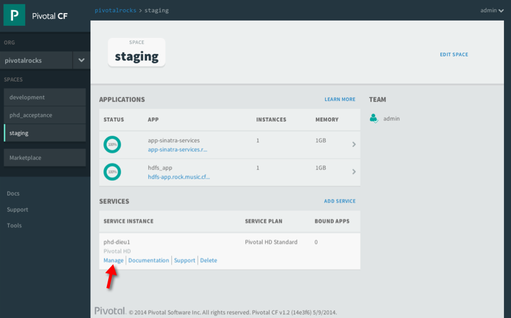
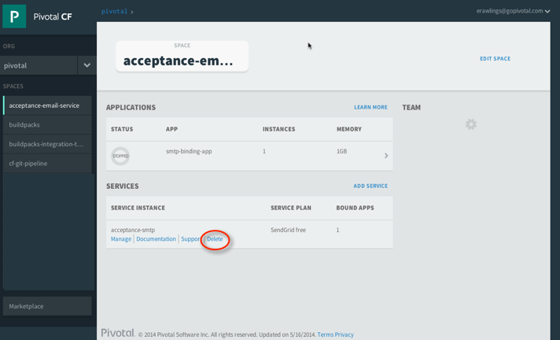
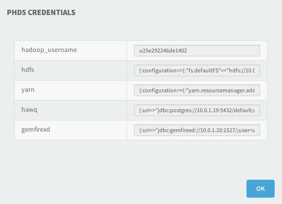

After the Pivotal CF Administrator deploys the Pivotal HD Service, Pivotal CF Users can create instances of the service, resulting in a pre-deployed Pivotal HD cluster that is allocated for their use.  Pivotal CF Users can subsequently bind applications that were pushed from Elastic Runtime to a Pivotal HD Service Instance in order to create and embed user credentials and API endpoints.

* [Creating Pivotal HD Cluster Instances](#create-cluster)
* [Deleting Pivotal HD Cluster Instances](#delete-cluster)
* [Binding Applications to Pivotal HD Cluster Instances](#binding)
* [Unbinding Applications from Pivotal HD Cluster Instances](#unbinding)

#Using a Pivotal HD Service Instance

You use either the Pivotal CF Developer Console or the Pivotal CF command line interface to create Pivotal HD Service Instances. 

##Pivotal CF Developer Console

To create an instance of a Pivotal HD Service Plan using the Pivotal CF Developer Console: 

1. Log in to the **Pivotal CF Developer Console**.  

2. Select your Org from the drop-down list on the left. 

3. Select **Marketplace** from the left navigation menu. 

	The **Services Marketplace** displays.

4. Select **Pivotal HD**.

	The **Pivotal HD Service** page displays.

5. Click **Create a Service**.

	The **Add a new Service Instance** page displays.
	
6. Enter a name for this PHD service instance. 

7. Select a space from the **Add to Space** drop-down list.

8. (Optional) Select an application from the **Bind to App** drop-down list. The drop-down list displays available applications previously configured for this Org and Space. If you do not want to bind an application, select **[do not bind]**.

9. Click **Add**. 

A Pivotal HD Service Instance is created.  In the case of an on-demand service plan, you have been allocated a dedicated Pivotal HD sandbox. In the case of a Pivotal HD external service plan, the existing Pivotal HD software’s details are ready to be bound to an application. The service instance displays in the list of services for the current space

**Pivotal CF Developer Console**

	
Click **Manage** to view the **Service Instance Dashboard** for the service:

You can click the links to access the Web interface for a component.	

For more information about the the Pivotal CF Developer Console, see [Getting Started with the Developer Console](http://docs.pivotal.io/pivotalcf/console/dev-console.html).

##Pivotal CF Command Line

To create a Pivotal HD cluster instance:

1. Install the Pivotal CF Command Line Interface.  For more information on the Pivotal CF Command Line Interface, see [Installing the Pivotal CF CLI](http://docs.pivotal.io/pivotalcf/devguide/installcf/whats-new-v6.html).

2. Log in to Pivotal CF using the Pivotal CF CLI. See [Getting Started with cf v6](http://docs.pivotal.io/pivotalcf/devguide/installcf/whats-new-v6.html).

2. Run the following commands:
	
    `$ cf login [-a API_URL] [-u USERNAME] [-p PASSWORD] [-o ORG] [-s SPACE]` 
	(This command takes care of logging in, and also targets the correct org and space simultaneously. If you are already logged in, you can run the following command to target an org and space: 
	`$ cf target  -o <organization> -s <space name>`.)

	`$ cf marketplace` 
	(This command displays the name of the service plan.)

	`$ cf create-service p-hd [Service Plan Name] [Service Instance Name]`
	(This command creates the service instance.)

	`$ cf services` (This command displays the service instance.)
	
	Where:
	
* `[Service Plan name]` is the name of the Service Plan you see when you view the Pivotal HD Service in the Elastic Runtime marketplace.  Note that the Service Plan name is defined by the Pivotal CF Administrator. For more information on Service Plan definition, see [Creating a Service Plan](service_plans.html).

* `[Service Instance Name]` is a descriptive name of the instance you wish to use for this particular instance of the Service.
		
	For example:

	<pre  >
	$  cf login -a https://api.rock.music.cf-app.com -u admin -p 961fdc9cd6a85031f7eb -o pivotal -s staging
	API endpoint: https://api.rock.music.cf-app.com
	Authenticating...
	OK

	Targeted org pivotal

	Targeted space staging

	API endpoint: https://api.rock.music.cf-app.com (API version: 2.2.0)
	User:         admin
	Org:          pivotal
	Space:        staging
	$  cf marketplace
	Getting services from marketplace in org pivotal / space staging as admin...
	OK

	service   plans      description                                                            
	p-hd      Standard   Pivotal HD is the industry's most full-featured Hadoop distribution. 
	$  cf create-service p-hd Standard myPHDInstance
	Creating service myPHDInstance in org pivotal / space staging as admin...
	OK
	$  cf services
	Getting services in org pivotal / space staging as admin...
	OK

	name            service   plan       bound apps             
	myPHDInstance   p-hd      Standard   app-sinatra-services
	
</pre>	

#Deleting Pivotal HD Service Instances

You can delete a Pivotal HD Service Instance when it is no longer needed.  Doing so will permanently delete the allocated Pivotal HD Cluster and any data will be lost.

##Pivotal CF Developer Console

1. Log in to the **Pivotal CF Developer Console**.  

2. Select your Org from the drop-down list on the left. 

3. Select the space where your Pivotal HD cluster instance is deployed from the left navigation menu. 

	A list of applications and services instances displays.

3. Locate the row under **Services** that contains the service instance you want to delete and click **Delete**. 

	A confirmation dialog box displays.
	
	

##Pivotal CF Command Line

1. Log in to Pivotal CF using the Pivotal CF CLI. See [Getting Started with cf v6](http://docs.pivotal.io/pivotalcf/devguide/installcf/whats-new-v6.html).

2. Run the following commands:
	
    `$ cf login [-a API_URL] [-u USERNAME] [-p PASSWORD] [-o ORG] [-s SPACE]` 
	(This command takes care of logging in, and also targets the correct org and space simultaneously. If you are already logged in, you can run the following command to target an org and space: 
	`$ cf target  -o <organization> -s <space name>`.)

	`$ cf services` (This command displays a list of service instances.)
	
	`$ cf delete-service [Service Instance Name]`
	
	Where [Service Instance Name] is the name of the instance you are deleting.
	
	For example:

	<pre >
	[root@rock ~]# cf login -a https://api.rock.music.cf-app.com -u admin -p 961fdc9cd6a85031f7eb -o pivotal -s staging
	API endpoint: https://api.rock.music.cf-app.com
	Authenticating...
	OK

	Targeted org pivotal

	Targeted space staging

	API endpoint: https://api.rock.music.cf-app.com (API version: 2.2.0)
	User:         admin
	Org:          pivotal
	Space:        staging
	[root@rock ~]# cf services
	Getting services in org pivotal / space staging as admin...
	OK

	name            service   plan       bound apps             
	myPHDInstance   p-hd      Standard   app-sinatra-services
	
	
	[root@rock ~]# cf delete-service myPHDInstance

	Are you sure you want to delete the service myPHDInstance ? y
	Deleting service myPHDInstance in org pivotal / space staging as admin...
	OK
</pre>	

#Binding an Application to a Pivotal HD Cluster Instance

When a Pivotal CF User binds an application to a Pivotal HD Service Instance, user account credentials are automatically created in each software component of the allocated Pivotal HD cluster.  Both Credentials and API end-points are returned and included in the `VCAP_SERVICES` environment variable of the bound application.

For more information about binding, see the following topic in the Pivotal CF documentation: [Bind a Service](http://docs.pivotal.io/pivotalcf/devguide/services/bind-service.html).

##Viewing Binding Meta Data and Environment Variables

You can view the binding variables using the Pivotal CF Developers Console.

To view the binding variables from the **Pivotal CF Developer Console**:

1. Log in to the **Pivotal CF Developer Console**.  

2. Select your Org from the drop-down list on the left. 

3. Select the space where your Pivotal HD cluster instance is deployed from the left navigation menu. 

	A list of applications and services instances displays.

4. Locate your Pivotal HD instance in the list of Bound Services and click **Credentials**.

	A dialog box displays the credentials for the components of the Pivotal HD instance.
	For example:
	
	

	You may need to copy the contents of each field and paste them into a text editor to view them. 
	
##Binding an Application using the Pivotal CF Developer Console

1. Log in to the **Developer Console**. 

2. Select your Pivotal HD Cluster service.

3. Select the space where the application you want to bind is deployed.

	A list of deployed applications and services displays. 

5. Locate the row containing the application and click the **>** link. 

	A page displays that show the bound services and instances for this application.

6. Click **Bind**

	A list of a available services displays.

7. Click the **Bind** button for the service you want to bind to this application. 

##Binding an Application using the Pivotal CF Command Line
1. Log in to Pivotal CF using the Pivotal CF CLI. See [Getting Started with cf v6](http://docs.pivotal.io/pivotalcf/devguide/installcf/whats-new-v6.html).

2. Run the following commands:
	
    `$ cf login [-a API_URL] [-u USERNAME] [-p PASSWORD] [-o ORG] [-s SPACE]` 
	(This command takes care of logging in, and also targets the correct org and space simultaneously. If you are already logged in, you can run the following command to target an org and space: 
	`$ cf target  -o <organization> -s <space name>`.)

	`$ cf services` (This command displays a list of service instances.)
	
	`$ cf bind-service <application> <service instance name>`

	For example:
	
	<pre >
	[root@rock ~]#  cf login -a https://api.rock.music.cf-app.com -u admin -p 961fdc9cd6a85031f7eb -o pivotal -s staging
	API endpoint: https://api.rock.music.cf-app.com
	Authenticating...
	OK

	Targeted org pivotal

	Targeted space staging

	API endpoint: https://api.rock.music.cf-app.com (API version: 2.2.0)
	User:         admin
	Org:          pivotal
	Space:        staging
	[root@rock ~]#  cf services
	Getting services in org pivotal / space staging as admin...
	OK

	name            service   plan       bound apps             
	myPHDInstance   p-hd      Standard   app-sinatra-services
	
	[root@rock ~]# cf bind-service app-sinatra-services myPHDInstance
	Binding service myPHDInstance to app app-sinatra-services in org pivotal / space staging as admin...
	OK
	TIP: Use 'cf push' to ensure your env variable changes take effect
</pre>

#Unbinding an Application from a Pivotal HD cluster instance

You can unbind a bound application from a Pivotal HD cluster instance using either the Pivotal CF Developer Console or the Pivotal CF command line. 

##Pivotal CF Developer Console

1. Log in to the **Developer Console**. 

2. Select your Pivotal HD Cluster service.

3. Select space where the application you want to bind is deployed.

	A list of deployed applications and services displays. 

5. Locate the row containing the application and click the **>** link. 

	A page displays that show the bound services and instances for this application.

6. Locate the bound service instance you want to unbind and click **Unbind**.

	A confirmation dialog box displays. 

##Pivotal CF Command Line
1. Log in to Pivotal CF using the Pivotal CF CLI. See [Getting Started with cf v6](http://docs.pivotal.io/pivotalcf/devguide/installcf/whats-new-v6.html).

2. Run the following commands:
	
    `$ cf login [-a API_URL] [-u USERNAME] [-p PASSWORD] [-o ORG] [-s SPACE]` 
	(This command takes care of logging in, and also targets the correct org and space simultaneously. If you are already logged in, you can run the following command to target an org and space: 
	`$ cf target  -o <organization> -s <space name>`.)

	`$ cf services` (This command displays a list of service instances.)

	`$ cf unbind-service <application> <service instance name>`

	

