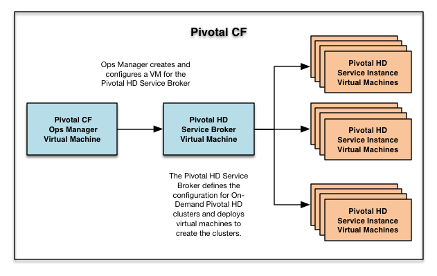

* [On-Demand Service Plans](#on-demand)
* [External Service Plans](#ext-plans)

The [Pivotal HD for Pivotal Cloud Foundry&reg;](https://network.pivotal.io/products/pivotal-hd-service) enables [Pivotal Cloud Foundry&reg;](https://network.pivotal.io/products/pivotal-cf) (PCF) Administrators to offer PCF users access to Pivotal HD software components for a variety of use cases.

Like other [PCF Services](http://docs.pivotal.io/pivotalcf/services/overview.html), access is presented as a series of Service Plans in [Elastic Runtime](http://docs.pivotal.io/pivotalcf/concepts/overview.html).  A PCF Administrator initially imports the Pivotal HD Service into Pivotal Cloud Foundry&reg; [Ops Manager](http://docs.pivotal.io/pivotalcf/customizing/) where they define the details of the service plans they wish to offer.

When PCF Administrators deploy the service, Ops Manger creates a BOSH deployment and uses its instance of BOSH to deploy a virtual machine where the Pivotal HD Service-Broker software process runs, along with a series of temporary VMs that register the Pivotal HD Service with Elastic Runtime and ensure that the deployment is successful.

There are two categories of Service Plans that can be offered using the Pivotal HD Service: On-Demand Service Plans and External Service Plans.  In either case, PCF users create instances of these Service Plans using either the Command Line Interface or the Apps Manager.

#On-Demand Service Plans

On-Demand Service Plans allow PCF developers to create their own dedicated instances of Pivotal HD software.  These instances are intended for integration testing with the application they are developing or as sandboxes for short-term use.

In the case of On-Demand Service Plans, the Pivotal HD Service-Broker uses BOSH to deploy a set of virtual machines that run the various software processes that comprise of a Pivotal HD instance.  The Service-Broker is capable of deploying multiple Pivotal HD instances.

**Figure 1** describes these virtual machines as created by Ops Manager and the Pivotal HD Service-Broker.

**Figure 1. Pivotal HD Virtual Machines.**

These Pivotal HD Service Instances are allocated each time a PCF user creates a Service Instance using the CLI or Apps Manager and the Service-Broker deploys additional instances as needed.

PCF users can also bind hosts, ports, and user credentials for each component to any application they push to Elastic Runtime.

**Figure 2.** shows the work flow for creating Pivotal HD clusters using Pivotal HD Service:

**Figure 2. Pivotal HD Service Work Flow**

Each Service Plan is a blueprint that describes the configuration and components of each Service Instance. The definition consists of:

* The Pivotal HD components to include
* The number of virtual machines to deploy that run the slave processes for each component
* The maximum number of Service Instances that can be created
* The number of pre-created Service Instances
* How much CPU, RAM and Disk space to use for each type of required virtual machine

On-Demand Service Plans can consist of several components from the Pivotal HD 2.0.1 software stack, including:

* Hadoop (HDFS, YARN and MapReduce2)
* HAWQ and PXF
* GemFire XD

For more details about the individual software components and their versions, please see the [Pivotal HD Enterprise 2.0.1 Release Notes](http://pivotalhd-210.docs.pivotal.io/doc/2010/PHDEnterprise2.0.1ReleaseNotes.html#PHDEnterprise2.0.1ReleaseNotes-VersioningandCompatibility).

The Pivotal HD Service Broker is the software responsible for deploying each Service Instance’s virtual machines in advance, eliminating the need for PCF users to wait when creating an instance of the service.

PCF Administrators can define multiple Service Plans. Each On-Demand Service Plan can create differently-sized Pivotal HD clusters or clusters comprised of different Pivotal HD software components.

Lastly, the administrator has the option to not include the HDFS component as a part of each Service Instance and instead automate each included component’s configuration to use a pre-existing instance of HDFS running on [EMC’s Isilon Scale-out Storage Solutions for Hadoop](http://www.emc.com/big-data/scale-out-storage-hadoop.htm).  In this scenario, HDFS is not co-located with the compute components and all data written by the software components is stored on Isilon. See [HDFS Isilon Integration](isilon.html).

#External Service Plans

External Service Plans enable PCF developers to bind the hosts and ports of Pivotal HD software that is already running to their PCF-pushed application hosted on Pivotal Cloud Foundry&reg;.  It is important to note that user credentials are not created automatically for the application during binding and developers will need to request these credentials from the administrators of the Pivotal HD software.

Administrators can define Multiple External Service Plans in order to broker access to different instances of Pivotal HD in parallel.

**Figure 3. External Service Plans**

See [Creating an External Service Plan](external-service-plans.html).

